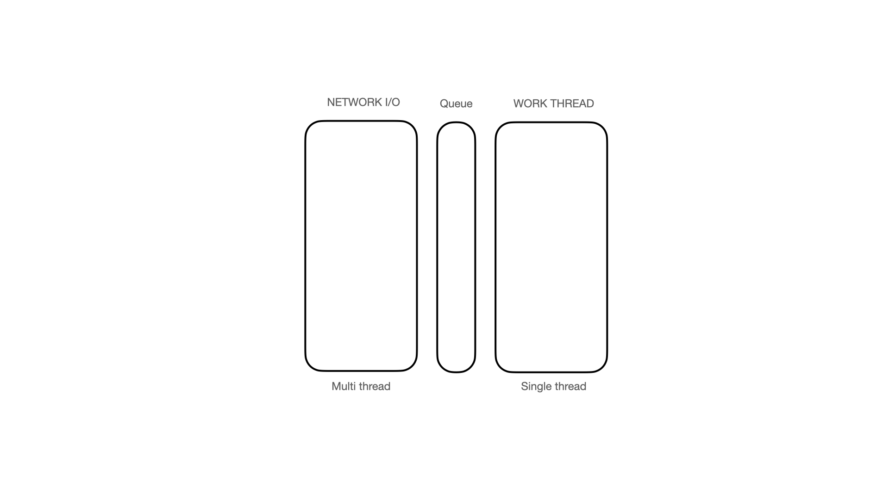

# OUR-PLAYGROUND 게임 서버

## 서버의 요구사항
1. 패킷 처리(Read/Write)
2. tick 처리(heartbeat)
3. 그 외 시스템

## 서버의 구조

생각하고 있는 서버의 구조는 아래와 같다.

게임 서버는 네트워크 IO는 멀티스레드 형태로 만들어 패킷을 읽은 후 큐에 넣는다. 이렇게 큐에 넣
워크 스레드는 싱글 스레드 구조로 매 Tick마다 큐에 있는 작업을 처리한다. 워크 스레드를 싱글 스레드로 구성하는 이유는 캐릭터 간의 상호작용에 있게되면 문제를 일으킬 수 있어서이다. 다만 현재 구상중인 기획에서는 캐릭터 간의 상호작용이 없어, 만약 캐릭터 간의 상호작용이 없는 것이 확정된다면 워크 스레드 또한 멀티스레드로 할 것을 고민중이다.

처리할 명령들은 Queue 를 구현해 기록한 후, Queue 에서 WORK THREAD가 정보를 읽어와 처리하도록 한다. 게임 서버 개발은 처음이고 레퍼런스가 적어 일단 이렇게 간단하게 구현한 후 테스트를 해보면서 문제점을 해결해보자.